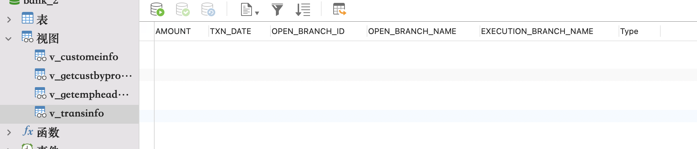

## <center>作业5-10185102142-李泽浩


##### （1）定义视图v_customeInfo，要求可以替换同名视图，列出所有客户相关信息，输出属性包括客户编号（CUST_ID）、完整联系地址（PROVICIAL_REGION、CITY与ADDRESS三个字段拼接）、邮政编码（POSTAL_CODE）、客户名称（类型为I的客户输出在Individual表中对应的姓名，使用LAST_NA ME与FIRST_NAME拼接；类型为B的客户输出在business表中对应的NAME

```sql
CREATE VIEW v_customeInfo AS
(
(SELECT c.CUST_ID, CONCAT(c.PROVICIAL_REGION,"-",c.CITY,"-",c.ADDRESS) as full_address,
			c.POSTAL_CODE, CONCAT(i.LAST_NAME,i.FIRST_NAME,"+") as full_name
FROM customer as c INNER JOIN individual as i on c.CUST_ID = i.CUST_ID
WHERE c.cust_type_cd = "I")
	UNION
(SELECT c.CUST_ID, CONCAT(c.PROVICIAL_REGION,c.CITY,c.ADDRESS) as full_address,
			c.POSTAL_CODE, b.`NAME` as name
FROM customer as c INNER JOIN business as b on c.CUST_ID = b.CUST_ID
WHERE c.cust_type_cd = "B")
);
```


##### （2）定义视图v_transInfo，从acc_transaction中查出不在其开户行进行的交易记录信息（即EXECUTION_BRANCH_ID不为该账户对应的OPEN_BRANCH_ID），输出属性包括交易金额（AMOUNT）、交易时间（TXN_DATE）、交易类型（CD显示为现金存入，CW显示为现金取出，TF显示为汇款转出，TT显示为汇款转入，IC显示为利息计入，LI显示为贷款拨入）、执行交易的分支机构名称（EXECUTION_BRANCH_NAME）、开户分支银行名称（OPEN_BRANCH_NAME）

```sql
CREATE VIEW v_transInfo AS
(
	SELECT c.AMOUNT, c.TXN_DATE, a.OPEN_BRANCH_ID, b.`NAME` as "OPEN_BRANCH_NAME",
					b1.`NAME` as EXECUTION_BRANCH_NAME,
					(CASE WHEN c.TXN_TYPE_CD = "CD" THEN "现金存入"
								WHEN c.TXN_TYPE_CD = "CW" THEN "现金取出"
								WHEN c.TXN_TYPE_CD = "TF" THEN "汇款转出"
								WHEN c.TXN_TYPE_CD = "TT" THEN "汇款转入"
								WHEN c.TXN_TYPE_CD = "IC" THEN "利息计入"
								WHEN c.TXN_TYPE_CD = "LI" THEN "贷款拨入"
					END) 
					as Type
	FROM acc_transaction as c INNER JOIN account as a on c.ACCOUNT_ID = a.ACCOUNT_ID,
			branch as b, branch as b1
	WHERE c.EXECUTION_BRANCH_ID <> a.OPEN_BRANCH_ID
				AND a.OPEN_BRANCH_ID = b.BRANCH_ID
				AND c.EXECUTION_BRANCH_ID = b1.BRANCH_ID
);
```




##### （3）为了备份数据或复制生产数据进行测试，经常会需要把数据从现有的表复制到新的（临时）表中，可以用CREATE TABLE ... AS ...子句进行表的复制。创建存储过程（copyTransactionFrom），该存储过程接收一个参数：起始日期（fDATE），功能是将acc_transaction表中交易日期（TXN_DATE）晚于等于起始日期的记录全部信息复制到新表（acc_transactionNew）中（该表如存在应先删除）。提示：在存储过程中执行DDL语句需要特殊处理。

```sql
DROP PROCEDURE IF EXISTS copyTransactionFrom;
CREATE PROCEDURE copyTransactionFrom(in fDATE datetime)
BEGIN
	DROP TABLE IF EXISTS acc_transactionNew;
	CREATE TABLE acc_transactionNew AS
		SELECT *
		FROM acc_transaction
		WHERE TXN_DATE >= fDATE;
END;

CALL copyTransactionFrom('2015-12-28 00:00:00')
```


##### （4）编写函数func_vipid，接收输入参数after_date，返回开户日期（OPEN_DATE）晚于after_date的、且可用余额最多的账户对应的客户编号（CUST_ID）。

```sql
set global log_bin_trust_function_creators=TRUE;
DROP FUNCTION IF EXISTS func_vipid;
CREATE FUNCTION func_vipid(after_date date) RETURNS INT
BEGIN
	DECLARE id int;
	SET id=0;
	SELECT CUST_ID INTO id
	FROM account
	WHERE OPEN_DATE > after_date AND AVAIL_BALANCE >= 
	ALL(SELECT a1.AVAIL_BALANCE
			FROM account AS a1
			WHERE a1.OPEN_DATE > after_date
			);
	RETURN id;
END;
SELECT func_vipid('2013-12-15');
```

 


##### （5）编写函数func_rand_email，随机生成合法的邮箱地址，@之前为长度不超过50的字符串，字符串中符号可包括a-z、A-Z、0-9；@之后为163.com、hotmail.com或ecnu.edu.cn。

```sql
DROP FUNCTION IF EXISTS func_rand_email;
CREATE FUNCTION func_rand_email() RETURNS VARCHAR(75)
BEGIN
	DECLARE result VARCHAR(50) DEFAULT '';
	DECLARE front VARCHAR(50) DEFAULT '';
	DECLARE length INT;
	DECLARE back INT DEFAULT 0;
	DECLARE charset VARCHAR(70);
	DECLARE i INT DEFAULT 0;
	SET length=CEILING(RAND()*50);
	SET charset='abcdefghijklmnopqrseuvwxyzABCDEFGHIJKLMNOPQRSTUVWXYZ0123456789';
	WHILE i<length DO
		SET front=concat(front,substring(charset,floor(1+RAND()*62),1));
		SET i=i+1;
	END WHILE;
	SELECT RAND()*30 INTO back;
	IF back>=0 AND back<10 
		THEN SET result=concat(front,'@163.com');
	ELSEIF back>=10 AND back<20
		THEN SET result=CONCAT(front,'@hotmail.com');
	ELSE
		SET result=concat(front,'@ecnu.edu.cn');
	END IF;
	RETURN result;
END;
SELECT func_rand_email();
```


##### （6）编写函数func_rand_telnum，可随机生成长度为11为的手机号，开头为130 131 132 133 134 135 136 137 138 139 186 187 189 151 157。

```sql
DROP FUNCTION IF EXISTS func_rand_telnum;
CREATE FUNCTION func_rand_telnum() RETURNS VARCHAR(11)
BEGIN
	DECLARE res VARCHAR(11) DEFAULT('');
	DECLARE random INT;
	SET random = floor(RAND()*15);
	
	SELECT substring(floor(RAND()*10000),1,9) INTO res;
	SET res = CONCAT(res,substring(floor(RAND()*10000),1,9));
	
	IF random = 0 THEN
		SET res = CONCAT('130',res);
	ELSEIF random = 1 THEN
		SET res = CONCAT('131',res);
	ELSEif random = 2 THEN
		SET res = CONCAT('132',res);
	ELSEif random = 3 THEN
		SET res = CONCAT('133',res);
	ELSEif random = 4 THEN
		SET res = CONCAT('134',res);
	ELSEif random = 5 THEN
		SET res = CONCAT('135',res);
	ELSEif random = 6 THEN
		SET res = CONCAT('136',res);
	ELSEif random = 7 THEN
		SET res = CONCAT('137',res);
	ELSEif random = 9 THEN
		SET res = CONCAT('139',res);
	ELSEif random = 10 THEN
		SET res = CONCAT('187',res);
	ELSEif random = 11 THEN
		SET res = CONCAT('186',res);
	ELSEif random = 12 THEN
		SET res = CONCAT('189',res);
	ELSEif random = 13 THEN
		SET res = CONCAT('151',res);
	ELSEif random = 14 THEN
		SET res = CONCAT('157',res);
	END IF;
	
	RETURN res;
	
END;
SELECT func_rand_telnum();
```


