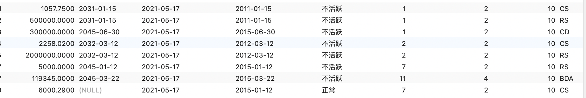

## <center>作业8-10185102142-李泽浩


##### 加载JDBC驱动程序，利用JDBC连接bank数据库

##### 1.使用JDBC批量(addBatch)执行的静态SQL：

a. 向account中插入数据('6000.29', null, '2018-01-12', '2015-01-12', '正常', '7', '2', '10', 'CS')

 b. 更新account中开户员工编号为10的最后活跃时间为（'2021-05-17'）

 c. 删除acc_transaction中交易金额最少的数据

```java
package com.company;
import java.sql.Statement;
import java.sql.Connection;
import java.sql.DriverManager;
import java.sql.PreparedStatement;
import java.sql.SQLException;
import java.sql.*;

public class Main {
    Connection con;
    public void getConnection() {
        try {
            Class.forName("com.mysql.jdbc.Driver");
            System.out.println("数据库驱动加载成功");
        } catch(ClassNotFoundException e){
            e.printStackTrace();
        }
        
        try {
            String url ="jdbc:mysql://localhost:3306/bank";
            String user="root";    //访问数据库的用户名
            String password="123456";    //访问数据库的密码
            con= DriverManager.getConnection(url,user,password);
            System.out.println("连接数据库成功！");

        } catch (SQLException ex) {
            System.out.println("连接数据库失败！");
            ex.printStackTrace();
        }
    }
    public void BatchInsert(){ //批量执行静态SQL语句
        try{
            Statement stmt = con.createStatement();
            stmt.addBatch("insert into account values(null, '6000.29', null, '2018-01-12', '2015-01-12', '正常', '7', '2', '10', 'CS');");
            stmt.addBatch("update account set LAST_ACTIVITY_DATE='2021-05-17' where OPEN_EMP_ID='10'");
            stmt.addBatch("DELETE FROM acc_transaction where TXN_ID=(select A.TXN_ID from(select TXN_ID FROM acc_transaction where AMOUNT<=ALL(select AMOUNT FROM acc_transaction)) as A)");

            stmt.executeBatch();
            stmt.close();
            System.out.println("数据库批量修改数据成功！");
        }catch(SQLException ec){
            System.out.println("数据库批量插入数据失败！");
            ec.printStackTrace();
        }
    }
    public static void main(String[] args) {
        Main c = new Main();
        c.getConnection();
        c.BatchInsert();
    }
}
```


(a)


(b)



(c)

删除前：


删除后：


##### 2.使用JBDC创建表stu包含字段（num(主键),name, weigh, birth）并用批量(addBatch)执行动态SQL向stu插入以下数据：

('张玉',57.50,'1994-9-1');
('何亮',62.7599,'1996-2-1');
('张静',54.45,'1999-2-3');

```java
import java.sql.Statement;
import java.sql.Connection;
import java.sql.DriverManager;
import java.sql.PreparedStatement;
import java.sql.SQLException;
import java.sql.*;

public class Main {
    Connection con;
    public void getConnection() {
        try {
            Class.forName("com.mysql.cj.jdbc.Driver");
            System.out.println("数据库驱动加载成功");
        } catch(ClassNotFoundException e){
            e.printStackTrace();
        }
        //String sql = "SELECT * FROM customer";
        try {
            String url ="jdbc:mysql://localhost:3306/bank_2";
            String user="root";    //访问数据库的用户名
            String password="123456";    //访问数据库的密码
            con= DriverManager.getConnection(url,user,password);
            System.out.println("连接数据库成功！");

        } catch (SQLException ex) {
            System.out.println("连接数据库失败！");
            ex.printStackTrace();
        }
    }
    public void Create_Table(){
        try {
            Statement stmt1 = con.createStatement();
            String sql1 = "CREATE TABLE stu(" +
                    "num INT NOT NULL," +
                    "name varchar(255)," +
                    "weigh INT," +
                    "birth DATE," +
                    "PRIMARY KEY(num));";
            stmt1.executeUpdate(sql1);
            stmt1.close();
            System.out.println("stu表创建成功！");
        }catch(SQLException ec){
            System.out.println("stu表创建失败！");
            ec.printStackTrace();
        }
    }

    public void BatchInsert(){ //批量执行静态SQL语句
        try{
            Statement stmt = con.createStatement();
            stmt.addBatch("insert into stu values('1','张玉', '57.50','1994-9-1');");
            stmt.addBatch("insert into stu values('2','何亮','62.7599','1996-2-1');");
            stmt.addBatch("insert into stu values('3','张静','54.45','1999-2-3');");

            stmt.executeBatch();
            stmt.close();
            System.out.println("数据库批量修改数据成功！");
        }catch(SQLException ec){
            System.out.println("数据库批量插入数据失败！");
            ec.printStackTrace();
        }
    }
    public static void main(String[] args) {
        Main c = new Main();
        c.getConnection();
        c.Create_Table();
        c.BatchInsert();
    }
}
```


##### 3.使用JDBC查询account中可用余额大于5000的客户编号、产品编号、可用余额，按照可用余额升序排列，最终结果用System.out.print打印。

```java
import java.sql.Statement;
import java.sql.Connection;
import java.sql.DriverManager;
import java.sql.PreparedStatement;
import java.sql.SQLException;
import java.sql.*;

public class Main {
    Connection con;
    public void getConnection() {
        try {
            Class.forName("com.mysql.cj.jdbc.Driver");
            System.out.println("数据库驱动加载成功");
        } catch(ClassNotFoundException e){
            e.printStackTrace();
        }
        //String sql = "SELECT * FROM customer";
        try {
            String url ="jdbc:mysql://localhost:3306/bank_2";
            String user="root";    //访问数据库的用户名
            String password="123456";    //访问数据库的密码
            con= DriverManager.getConnection(url,user,password);
            System.out.println("连接数据库成功！");

        } catch (SQLException ex) {
            System.out.println("连接数据库失败！");
            ex.printStackTrace();
        }
    }
    public void Select(){
        try {
            Statement stmt1 = con.createStatement();
            String sql1 = "SELECT CUST_ID, PRODUCT_CD, AVAIL_BALANCE FROM account WHERE AVAIL_BALANCE > 5000\n" +
                    "ORDER BY AVAIL_BALANCE ASC;";
            ResultSet res = stmt1.executeQuery(sql1);

            while (res.next())
            {
                String cust = res.getString(1);
                String type = res.getString(2);
                String amount = res.getString(3);
                System.out.println("cust_id:"+cust+", product_cd:"+type+", avail_balance:"+amount);
            }
            System.out.println("查询成功！");
            res.close();
            stmt1.close();
            con.close();
        }catch(SQLException ec){
            System.out.println("查询失败！");
            ec.printStackTrace();
        }
    }

    public static void main(String[] args) {
        Main c = new Main();
        c.getConnection();
        c.Select();
    }
}
```

查询结果部分截图如下：


##### 4.建立存储过程pro_ updateAccount,使用Connection对象的prepareCall调用存储过程pro_updateAccount:

 a.对于客户(customer)所在城市为上海的，若可用余额大于100000，增加可用余额5000，否则增加余额1000；

 b.客户城市在杭州的，若LAST_ACTIVATE_DATE与OPEN_DATE间隔大于365天，可用余额增加百分之20，否则增加百分之10.

```mysql
#存储过程
DROP PROCEDURE IF EXISTS pro_updateAccount;

CREATE PROCEDURE pro_updateAccount()
BEGIN
    DECLARE id INT;
    DECLARE cid INT;
    DECLARE balance DECIMAL(12,4);
    DECLARE odate DATETIME;
    DECLARE ladate DATETIME;
    DECLARE city VARCHAR(20);
    
		DECLARE cur CURSOR FOR 
			SELECT ACCOUNT_ID,AVAIL_BALANCE,OPEN_DATE,LAST_ACTIVITY_DATE,CUST_ID 
			FROM account;
    DECLARE exit HANDLER FOR NOT FOUND CLOSE cur;
    OPEN cur;
    
    REPEAT
        FETCH cur INTO id,balance,odate,ladate,cid;
        SELECT customer.CITY INTO city
        FROM customer
        WHERE cid=customer.CUST_ID;
        UPDATE account
        SET AVAIL_BALANCE=CASE
            WHEN city="上海市" AND balance>100000 THEN
                balance+5000
            WHEN city="上海市" AND balance<=100000 THEN
                balance+1000
            WHEN city="杭州市" AND TIMESTAMPDIFF(DAY,odate,ladate)>365 THEN
                balance*1.2
            WHEN city="杭州市" AND TIMESTAMPDIFF(DAY,odate,ladate)<=365 THEN
                balance*1.1
            ELSE
                balance
        END
        WHERE id=account.ACCOUNT_ID;
    UNTIL 0 END REPEAT;
    CLOSE cur;
END
```


```java
//调用
import java.sql.Statement;
import java.sql.Connection;
import java.sql.DriverManager;
import java.sql.PreparedStatement;
import java.sql.SQLException;
import java.sql.*;

public class Main {
    Connection con;
    public void getConnection() {
        try {
            Class.forName("com.mysql.cj.jdbc.Driver");
            System.out.println("数据库驱动加载成功");
        } catch(ClassNotFoundException e){
            e.printStackTrace();
        }
        //String sql = "SELECT * FROM customer";
        try {
            String url ="jdbc:mysql://localhost:3306/bank_2";
            String user="root";    //访问数据库的用户名
            String password="123456";    //访问数据库的密码
            con= DriverManager.getConnection(url,user,password);
            System.out.println("连接数据库成功！");

        } catch (SQLException ex) {
            System.out.println("连接数据库失败！");
            ex.printStackTrace();
        }
    }
    public void Procedure(){
        try {
            String call="{call pro_updateAccount()}";
            CallableStatement callableStatement = con.prepareCall(call);
            callableStatement.execute();

            System.out.println("procedure 调用成功！");
            con.close();
        }catch(SQLException ec){
            System.out.println("procedure 调用失败！");
            ec.printStackTrace();
        }
    }

    public static void main(String[] args) {
        Main c = new Main();
        c.getConnection();
        c.Procedure();
    }
}
```


##### 5.使用Connection对象的prepareCall方法调用存储函数func_getHistoryID，接受输入参数txn_data、txn_type，返回交易时间在txn_data之后且交易类型为txn_type、账户编号最小的的交易历史编号,并在JDBC中用tx_data="2015-01-01",txn_type='CD'验证。

```mysql
#函数
DROP FUNCTION IF EXISTS func_getHistoryID;

CREATE FUNCTION func_getHistoryID(txn_data DATETIME, txn_type varchar(255)) 
RETURNS INT
BEGIN
	DECLARE id INT DEFAULT 0;
	
	SELECT min(TXN_ID) INTO id
	FROM(
		SELECT TXN_ID
		FROM acc_transaction as a
		WHERE a.TXN_DATE > txn_data AND a.TXN_TYPE_CD = txn_type
		) as M;
	
	RETURN id;
END;
```


```java
//调用
import java.sql.Statement;
import java.sql.Connection;
import java.sql.DriverManager;
import java.sql.PreparedStatement;
import java.sql.SQLException;
import java.sql.*;

public class Main {
    Connection con;
    public void getConnection() {
        try {
            Class.forName("com.mysql.cj.jdbc.Driver");
            System.out.println("数据库驱动加载成功");
        } catch(ClassNotFoundException e){
            e.printStackTrace();
        }
        //String sql = "SELECT * FROM customer";
        try {
            String url ="jdbc:mysql://localhost:3306/bank_2";
            String user="root";    //访问数据库的用户名
            String password="123456";    //访问数据库的密码
            con= DriverManager.getConnection(url,user,password);
            System.out.println("连接数据库成功！");

        } catch (SQLException ex) {
            System.out.println("连接数据库失败！");
            ex.printStackTrace();
        }
    }
    public void Procedure(){
        try {

            String call="{? = CALL func_getHistoryID(?,?)}";
            CallableStatement callableStatement=con.prepareCall(call);
            callableStatement.registerOutParameter(1,Types.BIGINT);
            callableStatement.setDate(2,Date.valueOf("2015-01-01"));
            callableStatement.setString(3,"CD");
            callableStatement.execute();

            String res = callableStatement.getString(1);
            System.out.println("ID = "+ res +".");

            System.out.println("procedure 调用成功！");
            callableStatement.close();
            con.close();
        }catch(SQLException ec){
            System.out.println("procedure 调用失败！");
            ec.printStackTrace();
        }
    }

    public static void main(String[] args) {
        Main c = new Main();
        c.getConnection();
        c.Procedure();
    }
}
```


