# <center>作业报告

 

## <center>题目：      *本科生教务信息管理系统*          

 

 

| 学号姓名： | 李泽浩  10185102142 |
| ---------- | ------------------- |
|            |                     |
| 完成时间： | 2021/06/07          |

 

 


 

<center>华东师范大学计算机科学与技术学院

<div style="page-break-after:always"></div>

[TOC]

<div style="page-break-after:always"></div>

## 一、系统需求分析

#### 1.系统描述

学生信息管理是大学的主要日常管理工作之一，涉及到学生的专业信息、住宿、选课、图书借阅等诸多方面，随着教学体制的不断改革,尤其是学分制、选课制的展开和深入，教务日常管理工作日趋繁重、复杂。如何把教务工作信息化、模块化、便捷化是现代高校发展的重点，因此如今一个完整统一、技术先进、高效稳定、安全可靠的学生信息管理系统已经成为大学教务不可或缺的一部分。 
本系统支持教务人员使用。在系统中，教务人员可以进行对学生的住宿情况、选课情况等基本信息进行查询、修改、删除等等。 
学生信息管理系统跨越了时间和空间的限制，学生的某一处信息需要变动的时候，该系统会自动修改相关所有需要改动的信息，不需要让教务一一更改，真正实现了学生信息的最便捷管理。

#### 2.数据存储需求

学生信息管理系统数据库需要存储如下信息。有关教务的信息，涉及教务编号、教务姓名、密码；学生的个人基本信息，涉及学生的学号、姓名、性别等等；班级信息，涉及班级的编号、所在专业、班长编号等等；专业信息，涉及专业编号、名称、学院编号；学院信息，涉及学院的编号、学院名称、院长；教师信息，涉及教师编号、电话、邮箱等等；课程信息，涉及编号、学分、类型等等；开设课程信息，涉及课程编号、开课学期、选课开始时间等等；宿舍信息，涉及编号、楼栋；书籍信息，涉及书籍编号、作者、出版社等等；可借图书信息，属性包括可借图书编号、可借副本编号、学号、借书日期、应还日期、罚款。
每个学生隶属于一个班级、可以借阅多本图书、在一个宿舍住宿、选择多门课程；每个班级隶属于一个专业；每个专业隶属于一个学院；每名教师隶属于一个学院并且教学多门课程。

#### 3.系统常做的查询与更新

经常做的查询，或许对创建索引有影响的：
•	查询学生所选课程信息
•	查询学生借阅的书籍
•	查询教师的授课信息
•	查询某学院所有专业信息
根据经常做的查询，需要创建有关视图的：
•	查询开课信息，包含课程名称、类型、学分，授课教师信息等等
关于更新
•	课程信息、开设课程信息、教师教学状态、班级状态、学生基本信息会以学期，学年等进行周期性更新。
•	专业、学院、教师、宿舍基本信息不会经常更新。
•	书籍借阅、学生选课状态、等会不定期进行更新。

#### 4.应用程序功能

后台的主要功能如下：
a.	课程查询：根据指定条件查询开设的课程；  
b.	学生基本信息：浏览、更新、插入学生基本信息； 
c.	课程信息查询：查询开设课程信息； 
d.	教师信息管理：管理教师信息； 
e.	学生课程信息管理：添加学生选课信息； 
f.	书籍借阅管理：管理书籍借阅的所有信息；
g.	学生信息查询：查询学生所有信息。

前台的主要功能如下：
a.  开课信息查询：查看本学期开课信息，方便学生后续选课
b.  学生选课：根据自已意愿值选课


## 二、数据库概念设计

#### 1.确定实体和属性

分析网上图书销售系统的系统需求，将系统中设计的人、物进行抽象，得到了系统的实体如下：

1)	教务信息实体集。属性包括：教务编号、教务姓名、密码；
2)	学生信息实体集。属性包括：学号、密码、性名、性别、电话、生日、班级编号、意愿值；
3)	班级实体集。属性包括：班级编号、班长学号、专业编号、人数；
4)	专业实体集。属性包括：专业编号、专业名称、学院编号；
5)	学院实体集。属性包括：学院编号、学院名称、院长；
6)	教师实体集。属性包括：教师编号、学院编号、密码、性别、姓名、电话、邮箱、薪资、生日；
7)	课程实体集。属性包括：课程编号、课程名称、考试类型、学分、类别、授课老师；
8)	书籍实体集。属性包括：书籍编号、作者、出版社、库存、出版年份、价格、类别、可借数量；
9)	管理员实体集。属性包括：管理员编号、管理员姓名、密码；
10)	宿舍实体集。属性包括：宿舍编号、楼栋编号；
11)	开设课程实体集。属性包括：课程编号、开课学期、课程名称、课程类别、考试时间、考试地点、选课开始时间、选课截止时间、人数上限；
12)	可借图书实体集。属性包括：可借图书编号、可借副本编号、学号、借书日期、应还日期、罚款。
系统的联系集如下：
1)	住宿联系集。属性包括：宿舍编号、学号、床号；
2)	教学联系集。属性包括：教师编号、课程编号、授课时间；
3)	选课联系集。属性包括：学号、开课编号、所投意愿值。

#### 2.E-R图


## 三、数据库逻辑结构设计

#### 1.关系模式设计

根据概念结构设计得到的 E-R 图和转换规则，得到如下关系模式（主外键此处未标，在基本表设计处体现）：
		教务实体表(教务编号，密码，教务姓名)
		学生实体表(学号，密码，性名，性别，电话，生日，班级编号，意愿值)
		班级实体表(班级编号，班长学号，专业编号，人数)
		专业实体表(专业编号，专业名称，学院编号)
		学院实体表(学院编号，学院名称，院长)
		教师实体表(教师编号，教师姓名，学院编号，密码，性别，电话，邮箱，薪资，生日)
		课程实体表(课程编号，课程名称，考试类型，学分，类别，授课老师)
		书籍实体表(书籍编号，作者，出版社，库存，出版年份，可借副本数量，价格，类别)
		管理员实体表(管理员编号，管理员姓名，密码)
		宿舍实体表(宿舍编号，楼栋编号)
		开设课程实体集(课程编号，开课学期，课程名称，课程类别，考试时间，考试地点，选课开始时间，选课截止时间，人数上限)
		可借图书实体集(可借图书编号，可借副本编号，学号，借书日期，应还日期，罚款)
		住宿联系表(宿舍编号，学号，床号)
		教学联系表(教师编号，课程编号，授课时间)
		选课联系表(学号，开课编号，所投意愿值)

#### 2.基本表设计

表3-1：教务表的设计

| 属性名   | 数据类型    | 是否可空 | 列约束 | 默认值 | 键   | 解释    |
| -------- | ----------- | -------- | ------ | ------ | ---- | ------- |
| 教务编号 | varchar(15) | 否       |        |        | 主键 | JWBH001 |
| 教务姓名 | varchar(20) | 是       |        |        |      |         |
| 密码     | varchar(15) | 否       |        | 12345  |      |         |

表3-2：专业表的设计

| 属性名   | 数据类型    | 是否可空 | 列约束 | 默认值 | 键   | 解释    |
| -------- | ----------- | -------- | ------ | ------ | ---- | ------- |
| 专业编号 | varchar(15) | 否       |        |        | 主键 | ZYBH001 |
| 专业名称 | varchar(50) | 否       |        |        |      |         |
| 学院编号 | varchar(15) | 是       |        |        | 外键 | XYBH001 |

表3-3：书籍表的设计

| 属性名       | 数据类型      | 是否可空 | 列约束 | 默认值 | 键   | 解释    |
| ------------ | ------------- | -------- | ------ | ------ | ---- | ------- |
| 书籍编号     | varchar(15)   | 否       |        |        | 主键 | SJBH001 |
| 作者         | varchar(30)   | 否       |        |        |      |         |
| 出版社       | varchar(30)   | 否       |        |        |      |         |
| 库存         | int(11)       | 是       |        |        |      |         |
| 出版年份     | date          | 是       |        |        |      |         |
| 可借副本数量 | int(11)       | 否       |        | 0      |      |         |
| 价格         | decimal(10,3) | 否       |        | 0.000  |      |         |
| 类别         | varchar(255)  | 否       |        |        |      |         |

表3-4：住宿表的设计

| 属性名   | 数据类型    | 是否可空 | 列约束 | 默认值 | 键         | 解释    |
| -------- | ----------- | -------- | ------ | ------ | ---------- | ------- |
| 宿舍编号 | varchar(10) | 否       |        |        | 主键       | SSBH001 |
| 学号     | varchar(10) | 否       |        |        | 主键、外键 |         |
| 床号     | int(11)     | 否       |        | 1      |            |         |

表3-5：可借图书表的设计

| 属性名       | 数据类型       | 是否可空 | 列约束 | 默认值 | 键   | 解释    |
| ------------ | -------------- | -------- | ------ | ------ | ---- | ------- |
| 可借图书编号 | varchar(15)    | 否       |        |        | 主键 | KJTS001 |
| 学号         | varchar(15)    | 否       |        |        |      | XH001   |
| 可解副本编号 | varchar(15)    | 否       |        |        |      | KJFB001 |
| 借阅日期     | date           | 否       |        |        |      |         |
| 归还日期     | date           | 否       |        |        |      |         |
| 罚款         | decimal(10，3) | 否       |        | 0.000  |      |         |

表3-6：学生表的设计

| 属性名   | 数据类型    | 是否可空 | 列约束 | 默认值 | 键   | 解释    |
| -------- | ----------- | -------- | ------ | ------ | ---- | ------- |
| 学号     | varchar(15) | 否       |        |        | 主键 | XH001   |
| 密码     | varchar(30) | 否       |        |        |      |         |
| 性别     | varchar(3)  | 是       |        |        |      |         |
| 姓名     | varchar(30) | 否       |        |        |      |         |
| 生日     | date        | 是       |        |        |      |         |
| 电话     | varchar(30) | 是       |        |        |      |         |
| 班级编号 | varchar(15) | 是       |        |        | 外键 | BJBH001 |
| 意愿值   | int(11)     | 否       |        | 100    |      |         |

表3-7：学院表的设计

| 属性名   | 数据类型    | 是否可空 | 列约束 | 默认值 | 键   | 解释    |
| -------- | ----------- | -------- | ------ | ------ | ---- | ------- |
| 学院编号 | varchar(15) | 否       |        |        | 主键 | XYBH001 |
| 学院名称 | varchar(50) | 否       |        |        |      |         |
| 院长     | varchar(20) | 否       |        |        |      |         |

表3-8：宿舍表的设计

| 属性名   | 数据类型    | 是否可空 | 列约束 | 默认值 | 键   | 解释    |
| -------- | ----------- | -------- | ------ | ------ | ---- | ------- |
| 宿舍编号 | varchar(10) | 否       |        |        | 主键 | SSBH001 |
| 楼栋编号 | varchar(30) | 否       |        |        |      | LDBH001 |

表3-9：教学表的设计

| 属性名   | 数据类型    | 是否可空 | 列约束 | 默认值 | 键         | 解释    |
| -------- | ----------- | -------- | ------ | ------ | ---------- | ------- |
| 教师编号 | varchar(10) | 否       |        |        | 主键       | JSBH001 |
| 课程编号 | varchar(10) | 否       |        |        | 主键、外键 | KCBH001 |
| 授课时间 | date        | 否       |        |        | 主键       |         |

表3-10：教师表的设计

| 属性名   | 数据类型     | 是否可空 | 列约束 | 默认值 | 键   | 解释    |
| -------- | ------------ | -------- | ------ | ------ | ---- | ------- |
| 编号     | varchar(10)  | 否       |        |        | 主键 | JSBH001 |
| 姓名     | varchar(30)  | 否       |        |        |      |         |
| 邮箱     | varchar(50)  | 否       |        |        |      |         |
| 性别     | varchar(3)   | 是       |        |        |      |         |
| 电话     | varchar(20)  | 是       |        |        |      |         |
| 薪资     | decimal(8,2) | 是       |        |        |      |         |
| 生日     | date         | 是       |        |        |      |         |
| 密码     | varchar(20)  | 是       |        |        |      |         |
| 学院编号 | varchar(10)  | 是       |        |        | 外键 | XYBH001 |

表3-11：班级表的设计

| 属性名   | 数据类型    | 是否可空 | 列约束 | 默认值 | 键   | 解释    |
| -------- | ----------- | -------- | ------ | ------ | ---- | ------- |
| 班级编号 | varchar(15) | 否       |        |        | 主键 | BJBH001 |
| 班长学号 | varchar(30) | 是       |        |        |      |         |
| 专业编号 | varchar(10) | 是       |        |        | 外键 | ZYBH001 |
| 人数     | int(11)     | 否       |        | 0      |      |         |

表3-12：管理员表的设计

| 属性名     | 数据类型     | 是否可空 | 列约束 | 默认值 | 键   | 解释     |
| ---------- | ------------ | -------- | ------ | ------ | ---- | -------- |
| 管理员编号 | varchar(255) | 否       |        |        | 主键 | GLYBH001 |
| 管理员姓名 | varchar(255) | 是       |        |        |      |          |
| 密码       | varchar(255) | 否       |        |        |      |          |

表3-13：课程表的设计

| 属性名   | 数据类型     | 是否可空 | 列约束 | 默认值 | 键   | 解释 |
| -------- | ------------ | -------- | ------ | ------ | ---- | ---- |
| 课程编号 | varchar(10)  | 否       |        |        | 主键 |      |
| 课程名称 | varchar(30)  | 否       |        |        |      |      |
| 考试类型 | varchar(30)  | 否       |        |        |      |      |
| 学分     | decimal(5,2) | 是       |        |        |      |      |
| 类别     | varchar(30)  | 否       |        |        |      |      |
| 授课老师 | varchar(255) | 是       |        |        |      |      |

表3-14：开设课程表的设计

| 属性名       | 数据类型     | 是否可空 | 列约束 | 默认值 | 键         | 解释    |
| ------------ | ------------ | -------- | ------ | ------ | ---------- | ------- |
| 课程编号     | varchar(15)  | 否       |        |        | 主键、外键 | KCBH001 |
| 开课学期     | varchar(255) | 否       |        |        | 主键       |         |
| 课程名称     | varchar(255) | 否       |        |        |            |         |
| 考试时间     | date         | 是       |        |        |            |         |
| 考试地点     | varchar(30)  | 是       |        |        |            |         |
| 选课开始时间 | datetime     | 是       |        |        |            |         |
| 选课截至时间 | datetime     | 是       |        |        |            |         |
| 人数上限     | decimal(5,2) | 是       |        |        |            |         |
| 课程类别     | varchar(255) | 是       |        |        |            |         |

表3-15：选课表的设计

| 属性名     | 数据类型     | 是否可空 | 列约束 | 默认值 | 键   | 解释    |
| ---------- | ------------ | -------- | ------ | ------ | ---- | ------- |
| 学号       | varchar(15)  | 否       |        |        | 主键 | XH001   |
| 开课编号   | varchar(255) | 否       |        |        | 主键 | KKBB001 |
| 所投意愿值 | decimal(4,0) | 否       |        |        |      |         |


## 四、数据库物理设计和实施

#### 1.数据库的创建

使用华为GaussDB(for MySQL)云数据库建立网上图书销售系统的数据库。 

#### 2.创建基本表

```sql
DROP TABLE IF EXISTS `教务`;
CREATE TABLE `教务` (
  `教务编号` varchar(15) NOT NULL,
  `教务姓名` varchar(255) DEFAULT NULL,
  `密码` varchar(15) NOT NULL DEFAULT '12345'
) ENGINE=InnoDB DEFAULT CHARSET=utf8;

DROP TABLE IF EXISTS `教学`;
CREATE TABLE `教学` (
  `教师编号` varchar(10) NOT NULL,
  `课程编号` varchar(10) NOT NULL,
  `授课时间` varchar(255) NOT NULL
) ENGINE=InnoDB DEFAULT CHARSET=utf8;

DROP TABLE IF EXISTS `教师`;
CREATE TABLE `教师` (
  `教师编号` varchar(15) NOT NULL,
  `学院编号` varchar(10) DEFAULT NULL,
  `教师姓名` varchar(30) NOT NULL,
  `性别` varchar(3) DEFAULT NULL,
  `邮箱` varchar(50) NOT NULL,
  `电话` varchar(20) DEFAULT NULL,
  `薪资` decimal(8,2) DEFAULT NULL,
  `生日` date DEFAULT NULL,
  `密码` varchar(20) DEFAULT NULL
) ENGINE=InnoDB DEFAULT CHARSET=utf8;

DROP TABLE IF EXISTS `班级`;
CREATE TABLE `班级` (
  `班级编号` varchar(15) NOT NULL,
  `班长学号` varchar(30) DEFAULT NULL,
  `专业编号` varchar(10) DEFAULT NULL,
  `人数` int NOT NULL DEFAULT '0'
) ENGINE=InnoDB DEFAULT CHARSET=utf8;

DROP TABLE IF EXISTS `管理员`;
CREATE TABLE `管理员` (
  `管理员编号` varchar(255) NOT NULL,
  `管理员姓名` varchar(255) DEFAULT NULL,
  `密码` varchar(255) NOT NULL DEFAULT '123456789'
) ENGINE=InnoDB DEFAULT CHARSET=utf8;

DROP TABLE IF EXISTS `课程`;
CREATE TABLE `课程` (
  `课程编号` varchar(10) NOT NULL,
  `教师编号` varchar(30) DEFAULT NULL,
  `课程名称` varchar(30) NOT NULL,
  `考试类型` varchar(30) NOT NULL,
  `学分` decimal(5,2) DEFAULT NULL,
  `类别` varchar(30) NOT NULL
) ENGINE=InnoDB DEFAULT CHARSET=utf8;

DROP TABLE IF EXISTS `选课`;
CREATE TABLE `选课` (
  `学号` varchar(15) NOT NULL,
  `课程编号` varchar(255) NOT NULL,
  `所投意愿值` decimal(4,0) DEFAULT NULL
) ENGINE=InnoDB DEFAULT CHARSET=utf8;
```

#### 3.触发器设计

````sql
1）当学生不想选某门课时，需要将该门课的意愿值归还到他所有的意愿值中。
DROP TRIGGER IF EXISTS xuanke_del;
CREATE TRIGGER xuanke_del BEFORE DELETE 
ON 选课 FOR EACH ROW
BEGIN
 DECLARE rest INT DEFAULT 0;
 DECLARE final INT DEFAULT 0;
 DECLARE zho INT DEFAULT 0;
 SELECT 意愿值 INTO rest
 FROM 学生
 WHERE `学生`.学号 = OLD.学号;
 SELECT 所投意愿值 INTO final
 FROM 选课
 WHERE 选课.学号 = OLD.学号 and `选课`.`开课编号`=OLD.开课编号;
 UPDATE 学生 SET 意愿值 = final+rest WHERE 学号 = OLD.学号;
END;
2）当学生选课时，判断其意愿值是否大于其所投意愿值，若大于则将其意愿值更新，否则拒绝该次选课操作。
DROP TRIGGER IF EXISTS xuanke_in;
CREATE TRIGGER xuanke_in BEFORE INSERT 
ON 选课 FOR EACH ROW
BEGIN
 DECLARE rest INT DEFAULT 0;
 DECLARE final INT DEFAULT 0;
 SELECT 意愿值 INTO rest
 FROM 学生
 WHERE `学生`.学号 = new.学号;
 IF rest >= new.所投意愿值 THEN 
  SET rest = rest- new.所投意愿值;
  UPDATE 学生 SET 意愿值 = rest WHERE 学号=new.学号;
 ELSE
  SIGNAL SQLSTATE '45000' SET MESSAGE_TEXT = "余额不足Insufficient Balance";
 END IF;
END;
3）当学生想要更改已选某门课的意愿值时，需要更新其新的意愿值以及是否能进行该次操作。
DROP TRIGGER IF EXISTS xuanke_up;
CREATE TRIGGER xuanke_up BEFORE UPDATE 
ON 选课 FOR EACH ROW
BEGIN
DECLARE rest INT DEFAULT 0;
DECLARE final INT DEFAULT 0;
DECLARE zho INT DEFAULT 0;
SELECT 意愿值 INTO rest
FROM 学生
WHERE `学生`.学号 = new.学号;
SELECT 所投意愿值 INTO final
FROM 选课
WHERE 选课.学号 = new.学号 and `选课`.`开课编号`=new.开课编号;
SET zho = final+rest;
SET zho = rest+ final;
IF zho >= new.所投意愿值 THEN 
	SET zho = zho- new.所投意愿值;
	UPDATE 学生 SET 意愿值 = zho WHERE 学号=new.学号;
ELSE
	

```
SIGNAL SQLSTATE '46000' SET MESSAGE_TEXT = "余额不足Insufficient Balance";
```

END IF;
END;
````

#### 4.存储过程设计

```sql
#1）	新增管理员，若存在则不能插入否则可以插入。
DROP PROCEDURE IF EXISTS add_user;
CREATE PROCEDURE add_user(IN id1 VARCHAR(15),name1 VARCHAR(15),passd1 VARCHAR(15))
BEGIN
DECLARE ans VARCHAR(15);
SELECT 密码 INTO ans
FROM `管理员`
WHERE 管理员编号 = id1;
IF ans IS NULL
		THEN INSERT INTO 管理员 VALUES(id1,name1,passd1);
ELSE
	SET ans = '插入失败';
	SELECT ans;
END IF;
END;

#2）	更改密码。接受用户账号、原密码、新密码作为参数，如原密码正确则更改密码为新密码并告知用户已成功修改，否则返回错误代码。
DROP PROCEDURE IF EXISTS update_passd;
CREATE PROCEDURE update_passd (in id VARCHAR(15),passd_befor VARCHAR(15),passd_new VARCHAR(15))
BEGIN
DECLARE before_ps VARCHAR(15);
SELECT 密码 INTO before_ps
FROM `学生`
WHERE id = 学号;
IF before_ps=passd_befor THEN 
	UPDATE 学生 SET 密码 = passd_new WHERE 学号 = id;
	SET before_ps = "密码已成功更改";
	SELECT before_ps;
ELSE
	SET before_ps = "原来密码输入错误，无法更改";
	SELECT before_ps;
END IF;
END;
```

#### 5.视图设计

```sql
#1）	全校学生名单
DROP VIEW IF EXISTS 全校学生名单;
CREATE VIEW 全校学生名单 AS
SELECT 学号,姓名,性别,生日,电话
FROM `学生`
ORDER BY `学号`;

#2）	专业及学院
DROP VIEW IF EXISTS 专业及学院;
CREATE VIEW 专业及学院 AS
SELECT 专业名称,学院名称,院长
FROM 专业,学院
WHERE `专业`.`学院编号` = `学院`.`学院编号`

#3）	不同学院老师名单
DROP VIEW IF EXISTS 信息学部教师名单;
CREATE VIEW 信息学部教师名单 AS
SELECT 教师编号,教师姓名,性别,邮箱,生日
FROM `教师`
WHERE `学院编号` = 'XYBH001';
DROP VIEW IF EXISTS 教育学部教师名单;
CREATE VIEW 教育学部教师名单 AS
SELECT 教师编号,教师姓名,性别,邮箱,生日
FROM `教师`
WHERE `学院编号` = 'XYBH002';
DROP VIEW IF EXISTS 心理与认知科学学院教师名单;
CREATE VIEW 心理与认知科学学院教师名单 AS
SELECT 教师编号,教师姓名,性别,邮箱,生日
FROM `教师`
WHERE `学院编号` = 'XYBH003';

#4）	不同学院学生的名单
DROP VIEW IF EXISTS 一班学生名单;
CREATE VIEW 一班学生名单 AS
SELECT 学号,姓名,性别,生日,电话
FROM `学生`
WHERE `班级编号` = 'BJBH001';
DROP VIEW IF EXISTS 二班学生名单;
CREATE VIEW 二班学生名单 AS
SELECT 学号,姓名,性别,生日,电话
FROM `学生`
WHERE `班级编号` = 'BJBH002';
DROP VIEW IF EXISTS 三班学生名单;
CREATE VIEW 三班学生名单 AS
SELECT 学号,姓名,性别,生日,电话
FROM `学生`
WHERE `班级编号` = 'BJBH003';
DROP VIEW IF EXISTS 四班学生名单;
CREATE VIEW 四班学生名单 AS
SELECT 学号,姓名,性别,生日,电话
FROM `学生`
WHERE `班级编号` = 'BJBH004';
DROP VIEW IF EXISTS 五班学生名单;
CREATE VIEW 五班学生名单 AS
SELECT 学号,姓名,性别,生日,电话
FROM `学生`
WHERE `班级编号` = 'BJBH005';
```


## 五、应用程序设计

#### 1.开发及运行环境介绍

​	程序设计语言是python 3.8，主要利用了python中tkinter 与 pymysql 库，主要开发工具是pycharm、Navicate Premium。

#### 2.主要功能设计

​		本数据库应用程序后台主要提供给本科生教务及管理员使用，通过输入自己的账户密码登录后，可以对学生、教师、选课信息进行一系列操作或展示，前台系统主要提供给学生使用，可以查看开课情况及根据自己意愿值进行选课。客户端为tkinter程序。

后台流程：

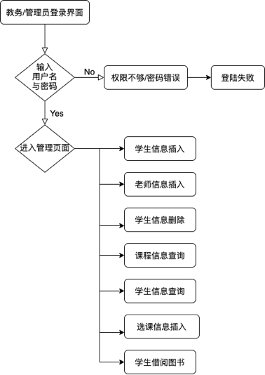

前台流程图：

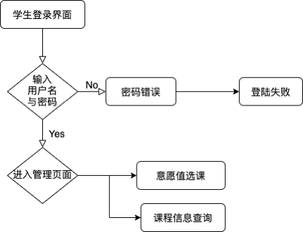

#### 3.主要界面

 图5-1 登陆界面

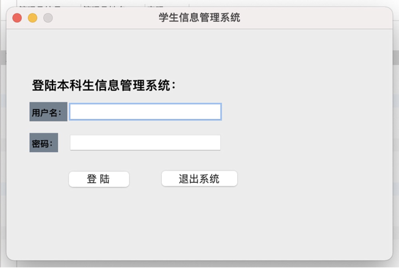


图5-2 登陆成功界面

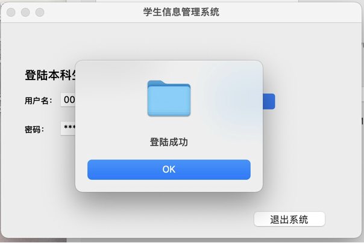

 

图5-3 主要操作界面

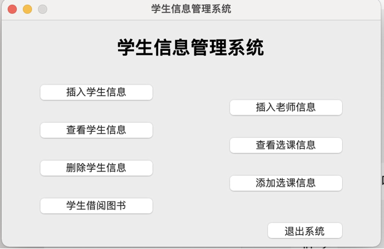


图5-4 学生信息添加界面

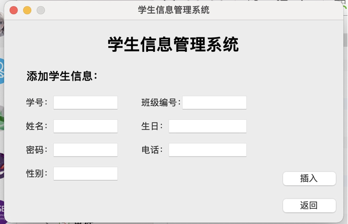


 图5-5 教师信息添加界面

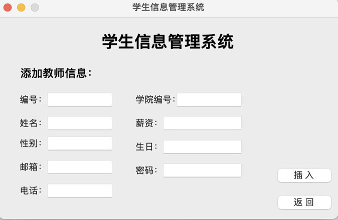

 

 图5-6 学生信息查询界面

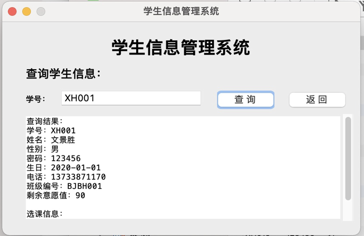


图5-7 课程信息查询界面

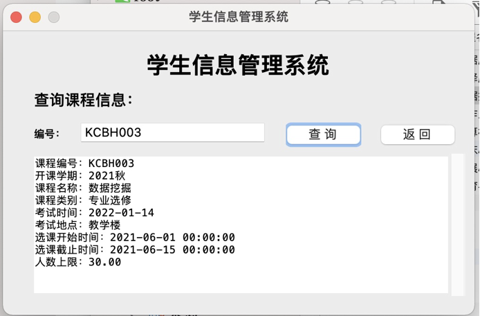

 

图5-8 学生信息删除界面

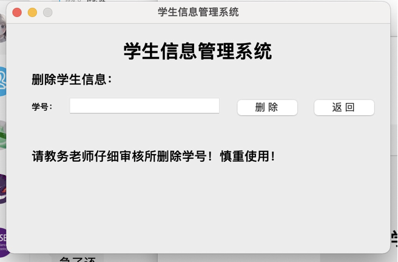


图5-9 选课信息插入界面

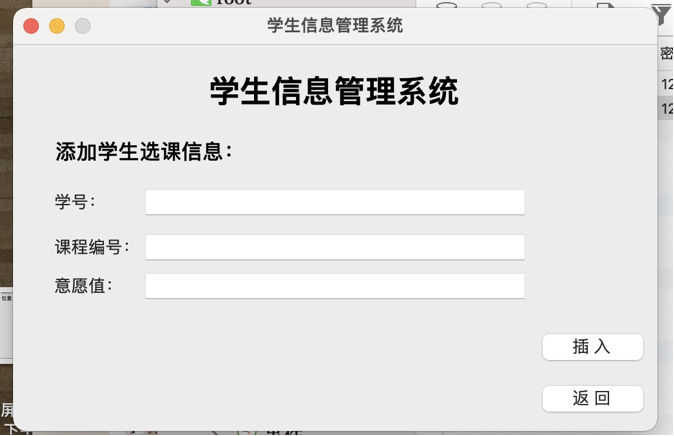


图5-10 添加学生借阅图书界面

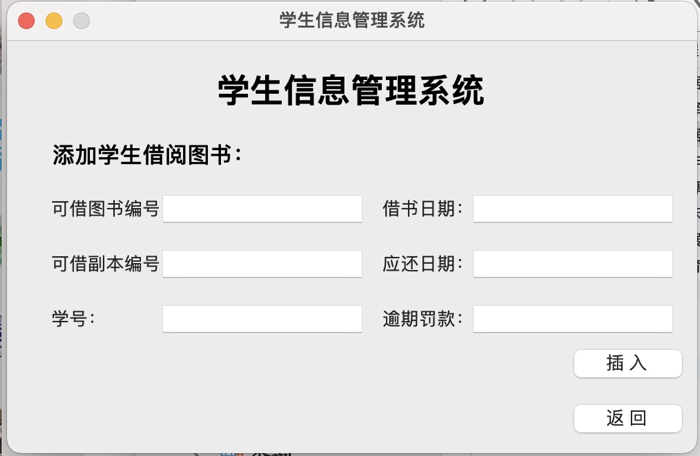

 

图5-11 学生登录界面

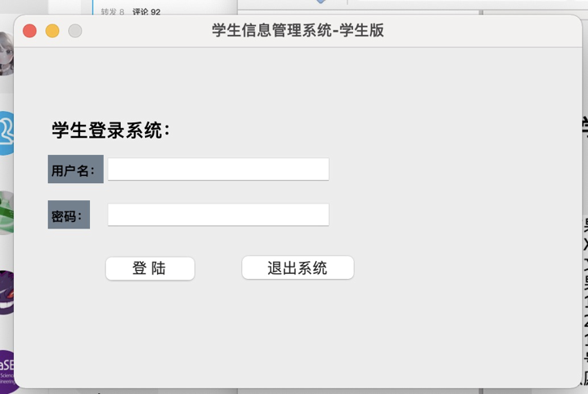

 

图5-12 学生功能主要界面

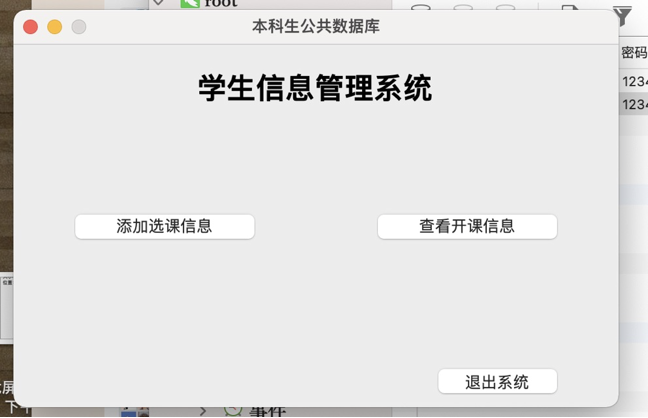


## 六、心得体会

​		数据库期末大作业设计，是我们在大三学完MYSQL数据库理论课程及实践课程之后对自己数据库方面的能力的一次很好的检验，从开始的ER图构建到基本表的创建再到前端界面的开发，都是一个很好的学习和锻炼的过程。使我们巩固了原有的理论知识，培养了我们灵活运用和组合集成所学过知识及技能来分析、解决实际问题的能力。使我们体会到自身知识和能力能在实际中的应用和发挥。不但可以激发创新意识，还可以开发创造能力、培养沟通能力。这次大作业时间虽然仅有两个多星期，但确实使我受益非浅。通过实践我丰富了python操作数据库的经验，更加深了对MYSQL数据库语言的了解，熟悉了其环境，更熟悉了对PYTHON的 GUI的使用技巧。
​		另外，在大作业编写过程中窦老师对我们进行了细心、耐心的指导，鼓励我们对程序进行合理改进，培养了我们的创新意识和创新能力。原来是我认为可怕的期末项目，就在种种辅助条件下完成了，心里有说不出的高兴。虽说捧着自己的成果很高兴，但成果背后总是付出很大的努力。
​		两个多礼拜中，我们有过山穷水尽的困惑；有过柳暗花明的惊喜；有过唇枪舌剑的辩论；有过相互鼓励的安慰。两个多礼拜的时间我们经历了很多，也收获了很多。与其说它是体力与脑力的作业，不如说它是合作精神和毅力的考验。经过这次课程设计，我不仅学到了很多知识和技能，更重要的是我们学会了如何运用所学知识去解决实际问题。
​		两个多礼拜的挣扎，绞尽脑汁终于带着麻木的手指和大脑脱出那堆‘泥潭”。现在的心情是如鱼得水，干涩的眼睛前方是万里晴空。终于，所有的努力即将化成了一个个铅字，打印机“滋滋”的声音仿佛已经宛如天籁般悦耳地在耳畔响起。心里在默默的感慨着:“有志者，事竟成，破釜沉舟，百二秦关终归楚。苦心人，天不负，卧薪尝胆，三千越甲可吞吴。”

 